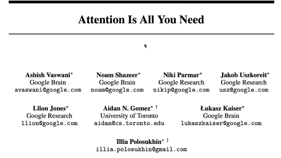
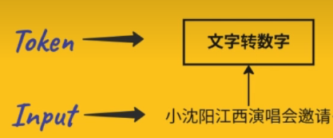
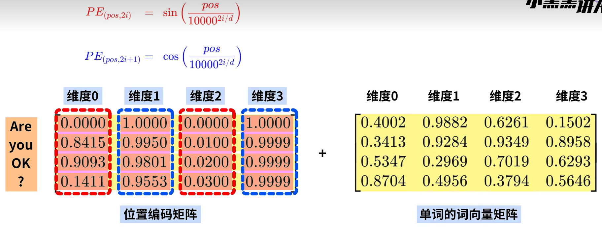

**article DOI**: https://doi.org/10.48550/arXiv.1706.03762
**b站视频**：
1. https://www.bilibili.com/video/BV14m421u7EM/?spm_id_from=333.337.search-card.all.click&vd_source=2c7c1ee8c8d56510f81bb51b53243439

### 模型解析

输入的文字文本叫做 Input
文本转换为对应的数字向量叫做 token

**1. 两个输入：待处理数据 & 已经标注好的正确output; 一个输出：模型处理得到的结果**

**2. 输入数据进入模型后，首先被第一个组件 input embedding分解为词向量, 而此时模型只接收到了每个词的特征向量，并不知道这些词的排列顺序,不具有位置信息**
**3. 对词向量进行位置编码，将位置信息向量加到原始词向量,构成编码向量**
**-transformer模型对于位置函数的要求：**
**1. 周期性：能支持任意长度的文本**   
**2. 取值范围有限：不会由于文本长度过长而影响其他参数的权重**

**在Transformer模型中，模型并没有显式地“提取”每个单词在源句中的位置，而是隐性的大概的地识别和利用了每个单词的位置信息**

