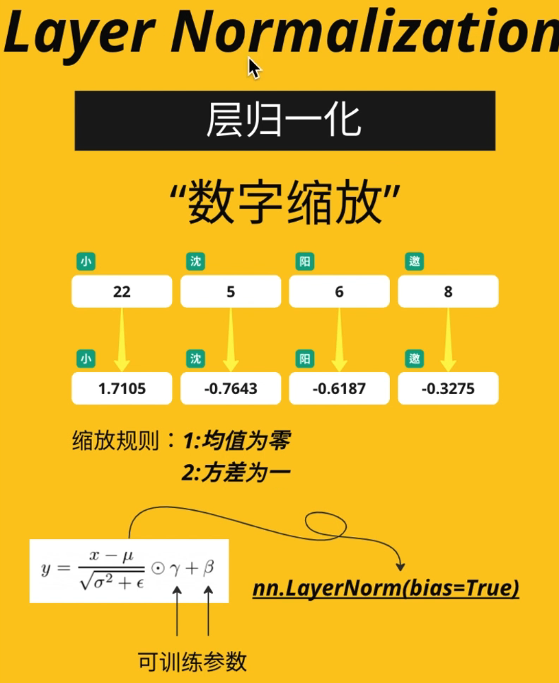
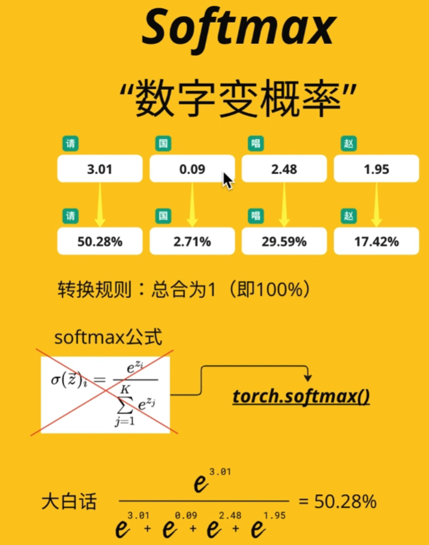
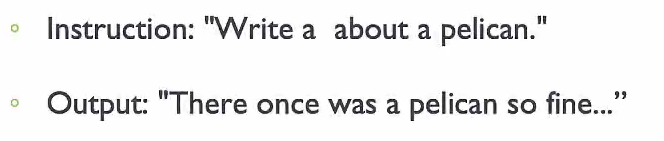

 https://doi.org/10.48550/arXiv.1706.03762
**b站讲解视频**：
1. https://www.bilibili.com/video/BV14m421u7EM/?spm_id_from=333.337.search-card.all.click&vd_source=2c7c1ee8c8d56510f81bb51b53243439
2. https://www.bilibili.com/video/BV1Zu4m1u75U?spm_id_from=333.788.player.switch&vd_source=2c7c1ee8c8d56510f81bb51b53243439

###   模型解析 
**1. 输入的文字文本叫做 Input 2. 文本转换为对应的数字向量叫做 token 3. 两个输入：待处理数据 & 已经标注好的正确output;  4. 一个输出：模型处理得到的结果**

###   位置编码
** inpou被input embedding分解为词向量, 而此时模型只接收到了每个词的语义特征向量，并不知道这些词的排列顺序,不具有位置信息**
** transformer模型对于位置函数的要求
 1 周期性：能支持任意长度的文本
 2 取值范围有限：不会由于文本长度过长而影响其他参数的权重 **
**transformer 采用的位置编码信息方式**

**在Transformer模型中，模型并没有显式地“提取”每个单词在源句中的位置，而是隐性的大概的地识别和利用了每个单词的位置信息**

###   Layer Normalization
 
###   Softmax 

###   经典LLM训练流程 
 **模型训练分为四个阶段:预训练(Pretraining)、监督微调(Supervised Finetuning)、对齐（Alignment）。**
**1. 自监督预训练(Pretraining):让大模型从大规模数据中学习，不依赖人工标注完成训练，因为训练/学习的标签(Label Data)是文本的后续单词，已经暗含在训练数据集中。 2. 第二阶段监督微调（SFT）仍然是[next token prediction」任务，区别在于预训练数据集，需要输入是一个人工标注的指令，其中包括期望大模型的回复内容。数据形式类似于：

    模型会将instruction作为Input，并逐个预测下一个token，向人工标注的output为目标调整。 3. 第三阶段（Alignment）主要目标在于将大模型与人类的偏好、价值观进行对齐，Reinforcement learning with human feedback（RLHF）。常用训练方法有PPO（强化学习）、DPO。。。。** 

**训练所需资源:预训练阶段的资源消耗巨大，使用数干颗GPU，花费数月时间，占总训练时间的99%。后面的三个阶段只需使用数十颗GPU，训练时间约数天。**